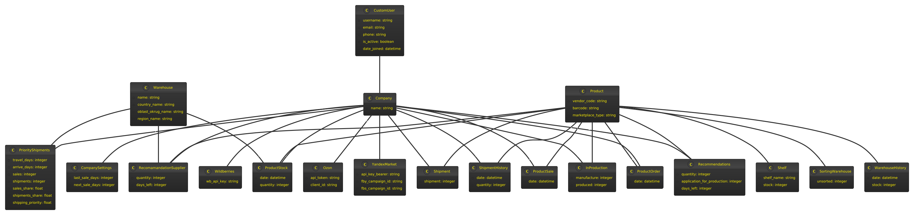

# Warehouse

This Django project integrates with the Ozon, Wildberries, and YandexMarket marketplace platforms, retrieving sales, orders, and inventory data for products. It calculates future inventory requirements based on this data. The system computes the sales shares by region and the distribution shares for product reserving, as well as the prioritization levels of products. Features include recommendations for production, storage in warehouses, delivery sections, and a history of product movements.

## APPS

### `accounts`
- **Purpose**: Manages user accounts and authentication.
- **Features**: Includes custom user models, user management views, and authentication mechanisms.

### `company`
- **Purpose**: Handles company-specific data and settings.
- **Features**: Manages company profiles, settings, and associated data like company-specific configurations.

### `product`
- **Purpose**: Deals with product information and inventory.
- **Features**: Manages product listings, inventory levels, and product updates from the integrated marketplaces.

### `orders`
- **Purpose**: Manages order processing.
- **Features**: Processes orders, tracks order status, and handles order-related interactions with the marketplaces.

### `sales`
- **Purpose**: Handles sales data and analytics.
- **Features**: Tracks sales performance, integrates sales data from marketplaces, and provides analytical insights.

### `warehouse`
- **Purpose**: Manages warehouse operations.
- **Features**: Includes functionalities for inventory storage, warehouse management, and logistics.

### `production`
- **Purpose**: Oversees production planning and execution.
- **Features**: Manages production schedules, material usage, and production output tracking.

## Key Features

- **Data Integration**: Seamlessly integrates with multiple marketplace platforms to synchronize product, sales, and inventory data.
- **Inventory Management**: Calculates and predicts inventory needs based on sales data and marketplace trends.
- **Analytics**: Provides detailed analytics on sales distribution by region, product prioritization, and inventory forecasting.
- **User Roles and Permissions**: Customizable access control for different user roles such as Super User, Production Manager, Manager, Warehouse Worker, and Machine Operator.

## Technologies Used

- **Django & Django REST Framework**: For building the backend API and web admin interface.
- **Celery with RabbitMQ**: For asynchronous task management and scheduled jobs.
- **PostgreSQL**: As the primary database for storing all operational data.

# Task Management Overview

This Django project utilizes Celery, an asynchronous task queue, to handle background tasks that are critical for integrating with marketplace platforms like Ozon, Wildberries, and YandexMarket. These tasks ensure the seamless operation of inventory updates, order processing, and data synchronization without impacting the performance of the web application.

## Celery Configuration

- **Broker**: RabbitMQ is used as the message broker for queuing tasks and managing the communication between Celery workers and the Django application.
- **Backend**: Results of the tasks are stored in a PostgreSQL database, which allows for task result persistence and state retrieval.

## Tasks

### `update_wildberries_sales`
- **Trigger**: Scheduled or triggered by specific events in the sales module.
- **Purpose**: Synchronizes sales data from the Wildberries marketplace, processes this data, and updates the internal sales records.

### `update_ozon_sales`
- **Trigger**: Runs on a schedule and upon certain trigger events.
- **Purpose**: Retrieves sales information from Ozon, integrating it into the company's sales analytics and records.

### `update_yandex_market_sales`
- **Trigger**: Scheduled to run at regular intervals.
- **Purpose**: Pulls sales data from YandexMarket and updates the database to reflect current sales metrics.

### `update_wildberries_orders`
- **Purpose**: Ensures all new and updated orders from Wildberries are fetched and processed according to the current business logic.

### `update_ozon_orders`
- **Purpose**: Regularly checks and integrates new orders from Ozon into the company's order management system.

### `update_yandex_market_orders`
- **Purpose**: Captures and updates order information from YandexMarket, ensuring accurate order tracking and processing.

### `update_wildberries_stocks`
- **Purpose**: Monitors and updates the stock levels for products listed on Wildberries to maintain accurate inventory records.

### `update_ozon_stocks`
- **Purpose**: Manages inventory updates for products sold on Ozon, crucial for inventory accuracy and planning.

### `update_yandex_stocks`
- **Purpose**: Regularly updates stock data from YandexMarket, ensuring the company's inventory system reflects real-time changes.

### `update_recomendations`
- **Purpose**: Analyzes sales and inventory data to generate and update product restocking recommendations, which are critical for maintaining optimal inventory levels.

### `update_recomendation_supplier`
- **Purpose**: Focuses on updating shipping recommendations based on current inventory levels and forecasted demand.

### `update_priority`
- **Purpose**: Adjusts the priority of shipments based on the latest sales trends and inventory requirements.

## Task Scheduling

- **Frequency**: Tasks related to sales, orders, and stock updates are typically scheduled to run at least daily to ensure data timeliness.
- **Manual Triggering**: Some tasks can also be manually triggered by admin users through the Django admin panel or a custom management interface, providing flexibility in operations.

These tasks are integral to the project's ability to provide real-time analytics and operational efficiency, ensuring the system remains responsive and up-to-date with external marketplace changes.

# Database Structure Overview

This Django project utilizes a PostgreSQL database to manage and store data across various functionalities centered around marketplace integration (Ozon, Wildberries, YandexMarket) and internal inventory and order management.

## Core Models and Their Relationships

### `Company`
- **Description**: Represents the company entities in the system. Each company can have multiple users and integrates with different marketplaces.
- **Fields**:
  - `name`: The name of the company.
  - `owner`: ForeignKey to `CustomUser`, representing the company owner.
  - `created_at`: DateTime field to record the creation time of the company entry.

### `CustomUser`
- **Description**: Extended user model that includes additional attributes specific to business needs.
- **Fields**:
  - Inherits from Django's base user model adding fields like `phone_number`, `is_active`, and role-based permissions.

### `Product`
- **Description**: Stores information about products listed on various marketplaces.
- **Fields**:
  - `vendor_code`: Unique identifier for the product.
  - `barcode`: Product barcode.
  - `marketplace_type`: Choice field to denote the marketplace (e.g., Wildberries, Ozon, YandexMarket).

### `Inventory`
- **Description**: Manages stock levels for products across different company warehouses.
- **Fields**:
  - `product`: ForeignKey to `Product`.
  - `warehouse`: ForeignKey to `Warehouse`.
  - `quantity`: Integer field representing stock quantity.
  - `date`: DateTime field for last update.

### `Order`
- **Description**: Records orders fetched from integrated marketplaces.
- **Fields**:
  - `product`: ForeignKey to `Product`.
  - `company`: ForeignKey to `Company`.
  - `quantity`: Number of items ordered.
  - `order_date`: DateTime of the order.

### `Sales`
- **Description**: Tracks sales data retrieved from marketplaces.
- **Fields**:
  - `product`: ForeignKey to `Product`.
  - `company`: ForeignKey to `Company`.
  - `sold_quantity`: Number of items sold.
  - `sale_date`: DateTime of the sale.

### `Warehouse`
- **Description**: Stores details about physical locations where inventory is held.
- **Fields**:
  - `location`: Text description of the location.
  - `capacity`: Integer field denoting how much stock the warehouse can hold.

### `Recommendations`
- **Description**: Generates and records product restocking recommendations based on sales and inventory trends.
- **Fields**:
  - `product`: ForeignKey to `Product`.
  - `recommended_quantity`: Suggested quantity to reorder.
  - `created_at`: DateTime field for recommendation generation.

## Database Design Choices

- **Normalization**: The database is normalized to reduce redundancy and improve data integrity. Relationships are carefully structured to maintain consistency across different modules.
- **Indexes**: Important fields such as `vendor_code` in `Product` and `location` in `Warehouse` are indexed to improve query performance, crucial for operations like sales analysis and inventory management.
- **Concurrency**: Concurrency handling mechanisms are in place to ensure that simultaneous updates (e.g., stock adjustments from multiple users) are managed correctly, using database transactions.

## Scalability Considerations

- **Partitioning**: Tables with large volumes of data, such as `Sales` and `Orders`, are candidates for partitioning to enhance performance and manageability.
- **Archiving**: Old data that is no longer frequently accessed but needs to be retained for historical analysis, such as past sales or orders, is archived periodically to keep the operational database size manageable.

This database structure provides a robust foundation for managing complex data interactions required by the system, ensuring scalability, performance, and data integrity.

